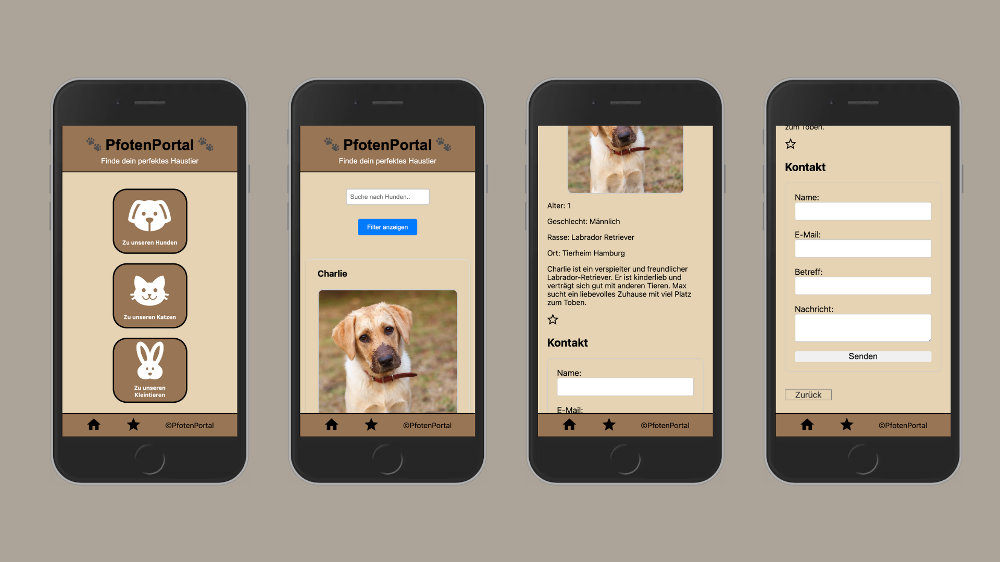

# Pfoten-Portal

## Capstone Project

Find and adopt your furry family member with this app. Explore a diverse selection of dogs, cats, and small animals from shelters and rescues. Filter by age, gender, and location. Bookmark favorites, view profiles, and make a seamless adoption. My mission is to connect shelters with loving families and promote responsible adoptions.

### Deployment

You can have a look at the last update of Pfoten-portal on Vercel: [DemoVersion](https://pfoten-portal.vercel.app)  
Note: The App is optimized for mobile screen.

### Tech Stack

- React
- React Hooks
- Next.js
- styled-components

### Project Setup

- Clone this repository
- Install all dependencies using `npm install`
- Run app in development mode using `npm run dev`, and open [http://localhost:3000/](http://localhost:3000/)
